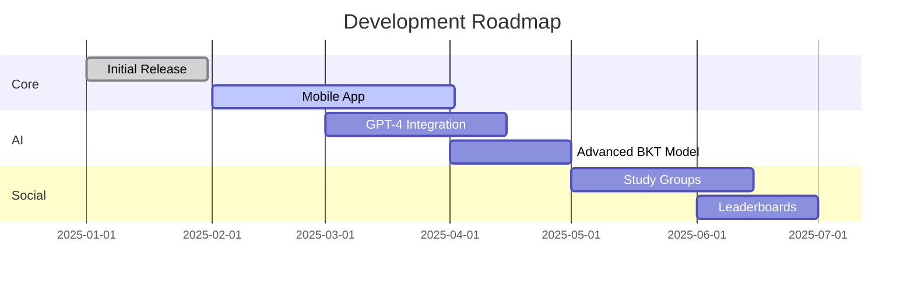

<div align="center">

# 🎓 studying.works

### Turn study sessions into high scores

[](https://react.dev/)
[](https://tailwindcss.com/)
[](https://firebase.google.com/)
[](LICENSE)
[](CONTRIBUTING.md)

[Live Demo](https://studying.works) • [Report Bug](https://github.com/yourusername/studying-works/issues) • [Request Feature](https://github.com/yourusername/studying-works/issues)


</div>

---

## ✨ Features

🤖 **AI Flashcard Generator** • Paste notes, get instant decks  
🧠 **BKT Smart Study** • Bayesian Knowledge Tracing algorithm  
🎴 **9 Study Modes** • Flashcards, quizzes, matching, speed challenges  
📊 **Progress Tracking** • Streaks, mastery scores, achievements  
🌍 **Community Library** • Share and discover study decks  
🔥 **Spaced Repetition** • Intelligent review scheduling  
📱 **Responsive Design** • Works on all devices  

---

## 🚀 Quick Start
```bash
# Clone the repo
git clone https://github.com/yourusername/studying-works.git

# Open in browser
open index.html

# Or serve locally
python -m http.server 8000
```

---

## 🛠️ Built With

<table>
<tr>
<td align="center" width="25%">

<br><strong>React</strong>
<br>UI Components
</td>
<td align="center" width="25%">

<br><strong>Firebase</strong>
<br>Auth & Database
</td>
<td align="center" width="25%">

<br><strong>Python</strong>
<br>ML Backend
</td>
<td align="center" width="25%">

<br><strong>Tailwind CSS</strong>
<br>Styling
</td>
</tr>
</table>

---

## 🏆 Credits & Acknowledgments

### 🧠 Machine Learning
**[pyBKT](https://github.com/CAHLR/pyBKT)** - Bayesian Knowledge Tracing  
*Badrinath, A., Wang, F., Pardos, Z. (2021). pyBKT: An Accessible Python Library of Bayesian Knowledge Tracing Models.*

### 🎨 Design Resources
- [Lucide Icons](https://lucide.dev/) - Beautiful icon set
- [Tailwind CSS](https://tailwindcss.com/) - Utility-first CSS framework
- [Google Fonts](https://fonts.google.com/) - Typography

### 📚 Inspiration
- [Anki](https://apps.ankiweb.net/) - Spaced repetition pioneer
- [Quizlet](https://quizlet.com/) - Study platform innovation
- [Khan Academy](https://www.khanacademy.org/) - Adaptive learning

### 🤖 AI Services
- [Anthropic Claude](https://www.anthropic.com/claude) - AI flashcard generation
- [OpenAI](https://openai.com/) - Natural language processing

---

## 📖 Documentation

📘 [User Guide](docs/USER_GUIDE.md)  
🔧 [BKT Setup](docs/BKT_SETUP.md)  
🏗️ [Architecture](docs/ARCHITECTURE.md)  
🤝 [Contributing](CONTRIBUTING.md)  

---

## 🎯 Roadmap


---

## 🌐 Browser Support

|  |  |  |  |
| --- | --- | --- | --- |
| Chrome ✅ | Firefox ✅ | Safari ✅ | Edge ✅ |
| Latest | Latest | Latest | Latest |

---

## 📜 License

Distributed under the MIT License. See `LICENSE` for more information.

---

<div align="center">

### Made with ❤️ by [Ben Hocquet](https://github.com/Benpitt)

**[⬆ back to top](#-studyingworks)**

---

© 2025 studying.works • [Terms](https://studying.works/terms.html) • [Privacy](https://studying.works/privacy.html) • [About](https://studying.works/about.html)

</div>
